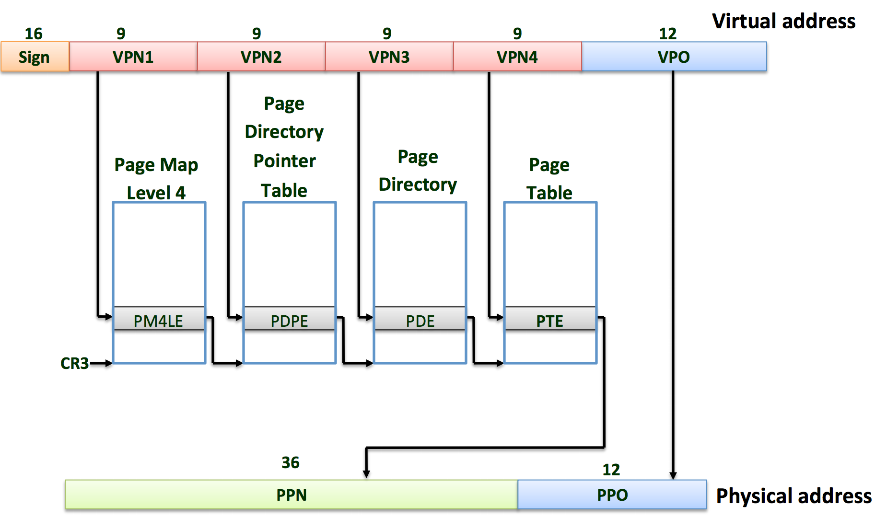

# Memory Management in xk

## Introduction
xk uses paging hardware to create virtual memory for user applications. To understand it, we start by describing the physical memory. Then we move to the address space. Finally, we describe how memory is managed in xk.

## Physical memory
A PC's physical address space is hard-wired to have the following
general layout:

	+------------------+  <- 0xFFFFFFFFFFFFFFFF (18 exabytes)
	|                  |
	|      Unused      |
	|                  |
	+------------------+  <- 0x0000000100000000 (4GB)
	|      32-bit      |
	|  memory mapped   |
	|     devices      |
	+------------------+  <- 0x00000000FE000000 (4GB - 32MB)
	|                  |
	|      Unused      |
	|                  |
	+------------------+  <- depends on amount of RAM
	|                  |
	|                  |
	| Extended Memory  |
	|                  |
	|                  |
	+------------------+  <- 0x0000000000100000 (1MB)
	|     BIOS ROM     |
	+------------------+  <- 0x00000000000F0000 (960KB)
	|  16-bit devices, |
	|  expansion ROMs  |
	+------------------+  <- 0x00000000000C0000 (768KB)
	|   VGA Display    |
	+------------------+  <- 0x00000000000A0000 (640KB)
	|                  |
	|    Low Memory    |
	|                  |
	+------------------+  <- 0x0000000000000000

The first PCs, which were based on the 16-bit Intel 8088 processor,
were only capable of addressing 1MB of physical memory. The physical
address space of an early PC would therefore start at `0x0000000000000000`
but end at `0x00000000000FFFFF` instead of `0x00000000FFFFFFFF`. The 640KB area marked
"Low Memory" was the only random-access memory (RAM) that an early
PC could use; in fact the very earliest PCs only could be configured
with 16KB, 32KB, or 64KB of RAM!

The 384KB area from `0x00000000000A0000` through `0x00000000000FFFFF` was reserved
by the hardware for special uses such as video display buffers and
firmware held in non-volatile memory. The most important part of
this reserved area is the Basic Input/Output System (BIOS), which
occupies the 64KB region from `0x00000000000F0000` through `0x00000000000FFFFF`. In
early PCs the BIOS was held in true read-only memory (ROM), but
current PCs store the BIOS in updateable flash memory. The BIOS is
responsible for performing basic system initialization such as
activating the video card and checking the amount of memory installed.
After performing this initialization, the BIOS loads the operating
system from some appropriate location such as floppy disk, hard
disk, CD-ROM, or the network, and passes control of the machine to
the operating system.

When Intel finally "broke the one megabyte barrier" with the 80286
and 80386 processors, which supported 16MB and 4GB physical address
spaces respectively, the PC architects nevertheless preserved the
original layout for the low 1MB of physical address space in order
to ensure backward compatibility with existing software. Modern PCs
therefore have a "hole" in physical memory from `0x00000000000A0000` to
`0x0000000000100000`, dividing RAM into "low" or "conventional memory" (the
first 640KB) and "extended memory" (everything else). In addition,
some space at the very top of the PC's 32-bit physical address
space, above all physical RAM, is now commonly reserved by the BIOS
for use by 32-bit PCI devices.

The detail of the memory layout may vary depending on your machine.
For example, when running on QEMU,
xk prints out the following "map" of the physical address space
(sometimes referred as the [E820 memory map](https://en.wikipedia.org/wiki/E820)):

```
E820: physical memory map [mem 0x9000-0x908f]
  [mem 0x0-0x9fbff] available
  [mem 0x9fc00-0x9ffff] reserved
  [mem 0xf0000-0xfffff] reserved
  [mem 0x100000-0xfdffff] available
  [mem 0xfe0000-0xffffff] reserved
  [mem 0xfffc0000-0xffffffff] reserved

```

It says that there are two available physical address ranges:
the first 639K and above 1MB.
The other ranges (including those _not_ mentioned in the E820 map)
are reserved by the BIOS and xk shouldn't use them.  Note that
E820 address ranges may overlap or even have holes; an address range
is safe for xk to use only if it shows up as "available" _and_ not
as "reserved."

When xk is configured for more than 4GB of physical RAM (i.e,
so RAM can extend further above `0x00000000FFFFFFFF`), the BIOS
must arrange to leave a _second_ hole in the system's RAM at the top
of the 32-bit addressable region, to leave room for these 32-bit
devices to be mapped. xk will use
only the first 16MB of a PC's physical memory, so it is not an issue.

## Address space
Each process has its own illusion of having the entire memory, which is called an address space. xk uses page tables (which are implemented by hardware) to give each process its own address space. The x86_64 page table translates (or ‘‘maps’’) a virtual address
(the address that an x86 instruction manipulates) to a physical address (an address
that the processor chip sends to main memory).

### x86_64 Specific Page Tables
x86_64 uses a page table to translate virtual memory address to physical memory address. An x86_64 page table is logically an array of 2^52 page table entries (PTEs). Each PTE contains a 20-bit physical page number (PPN) and some flags. Each physical table entry controls 4096 bytes of physical memory. Such a chunk is called a page.

Address translation happens in 4 steps. A page table is stored in physical memory as a 4-level tree. The root of the page table is written in register CR3. To translate a virtual address to a physical address, paging hardware of x86_64 walks the 4-level tree to find the correct physical address. Software implementation of the page walk is `walkpml4` in `kernel/x86_64vm.c`. `walkpml4` is a utility function to help xk manage the page table.



Each PTE contains flag bits that tell the paging hardware how the associated virtual address is allowed to be used. PTE_P indicates whether the PTE is present. PTE_W controls whether instructions are allowed to issue writes to the page. PTE_U controls whether user programs are allowed to use the page. Those flags are defined in `inc/mmu.h`.

xk maintains a separate page table for each process that defines that process’s
address space. As illustrated below, an address space includes the process’s
user memory starting at virtual address zero. Instructions (i.e., text) come first, followed by global variables, a ‘heap’ region (for malloc), and then stack. We call each region memory region. Memory region has a start and a size. In xk, we cap the maximum user memory per-application to be 2GB.

	+------------------+  <- 0xFFFFFFFFFFFFFFFF (18 exabytes)
	|                  |
	|      Kernel      |
	|                  |
	+------------------+  <- KERNBASE = 0xFFFFFFFF80000000
	|                  |
	|      Unused      |
	|                  |
	+------------------+  <- 2GB (vspace.regions[VR_USTACK].va_base)
	|                  |
	|       Stack      |
	|                  |
	+------------------+  <- vspace.regions[VR_USTACK].va_base - vspace.regions[VR_USTACK].size
	|                  |
	|                  |
	|      Unused      |
	|                  |
	|                  |
	+------------------+  <- vspace.regions[VR_HEAP].va_base + vspace.regions[VR_HEAP].size
	|       Heap       |
	+------------------+  <- vspace.regions[VR_HEAP].va_base
	|                  |
	|       Text       |
	|                  |
	+------------------+  <- vspace.regions[VR_CODE].va_base

Each process’s address space maps the kernel’s instructions and data as well as the user program’s memory. When a process invokes a system call, the system call executes
in the kernel mappings of the process’s address space. This arrangement exists so that the kernel’s system call code can directly refer to user memory. In order to leave plenty of room for user memory, xk's address spaces map the kernel at high addresses, starting at 0xFFFFFFFF80100000.

When xk boots, `userinit` (in `kernel/proc.c`) sets up a page table that maps virtual
addresses starting at 0xFFFFFFFF80000000 (called KERNBASE in `inc/mmu.h`) to physical addresses starting
at 0x0 as shown below. `userinit` also setups device memory (take a look at `setupkvm` in `kernel/x86_64vm.c`). `userinit` then setups user part of virtual memory.

	+---------+
	|  Kernel |
	+---------+  <- KERNBASE      |         |
	|  Unused |                   |         |
	+---------+  <- 2GB           +---------+
	|   User  |                   |  Kernel |
	+---------+  <- 0             +---------+  <- 0

	Virtual Memory               Physical Memory


## Memory management

The kernel must allocate and free physical memory at run-time for page tables, process user memory, kernel stacks, and pipe buffers. xk allocates and frees whole 4096-byte pages at a time. It keeps
track of which pages are free by using a bitmap style available field in each core map entry. Each core map entry represents the state of a physical memory page, similar to a `vpage_info` for the vspace.
Allocation consists of setting the `availiable` bit to 0 (in `kernel/kalloc.c`) flag in the core map; freeing consists of changing the `available` bit.

There is a bootstrap problem: all of physical memory must be mapped in order for the allocator to initialize the free list, but creating a page table with those mappings involves allocating page-table pages. xk solves this problem by allocating the static core map when xk starts initialization (see `mem_init` in `kernel/main.c`).

Kernel allocates and frees physical memory using `kfree` and `kalloc` (in `kernel/kalloc.c`). The function `kfree` begins by setting every byte in the memory being freed
to the value `0x02`. This will cause code that uses memory after freeing it (uses ‘‘dangling
references’’) to read garbage instead of the old valid contents; hopefully that will cause
such code to break faster. So if you see `0x0202020202` as an address in an error, you've likely referenced a freed page.
Address returned by `kalloc` and the argument passed into `kfree` is kernel virtual address. It has a static mapping to a physical address.
```
kernel virtual address = KERNBASE + physical address
```
When xk wants to map this page into user space, xk calls `mappages` (in `kernel/x86_64vm.c`) with a virtual address in the user space and the actually physical address.
